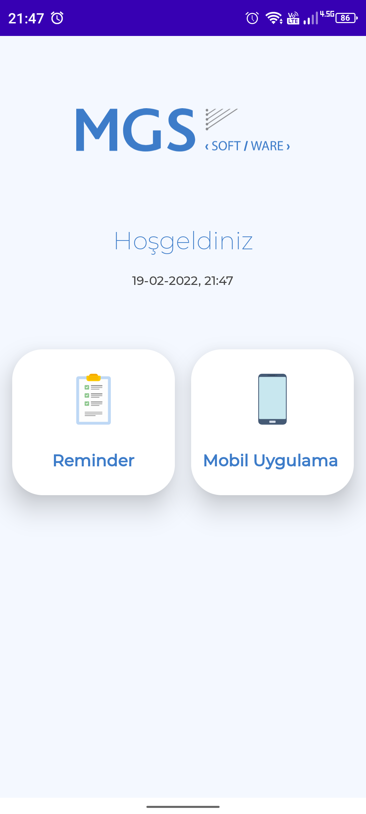
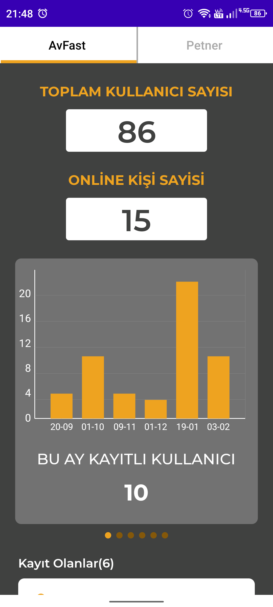
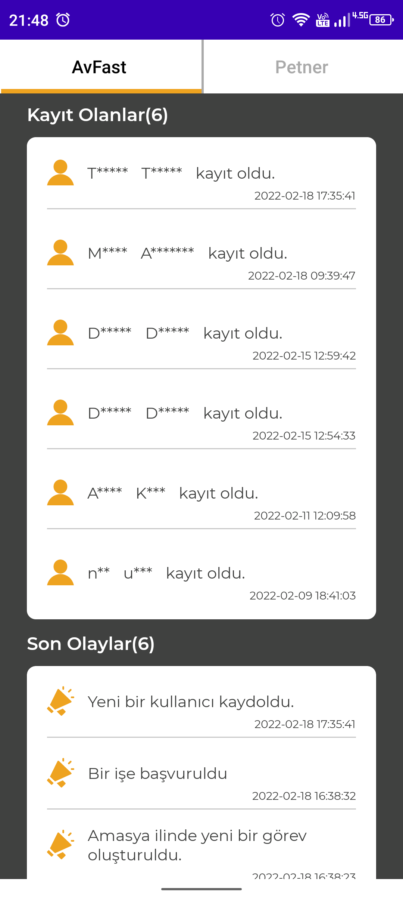
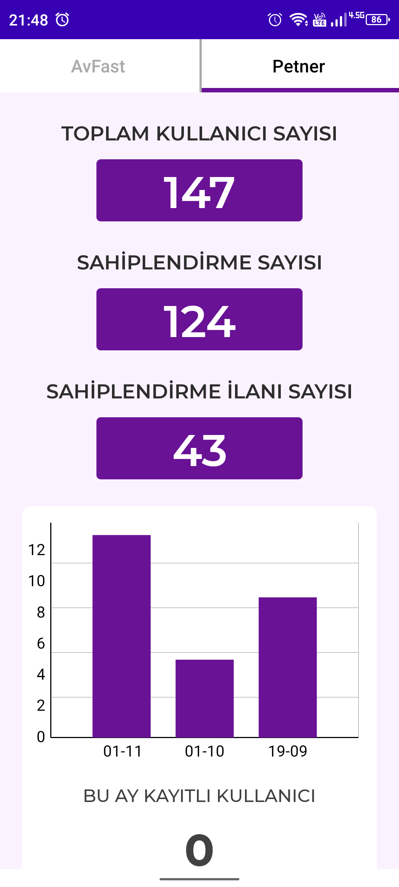

# MgsDashboard

## Used technologies

**Libraries:** 
Navigation Component, ViewBinding,
ARIndicatorView, MPAndroidChart, Retrofit,
Kotlin Serilization, ViewModel, LiveData, Hilt, Glide.

## Screen Shots

